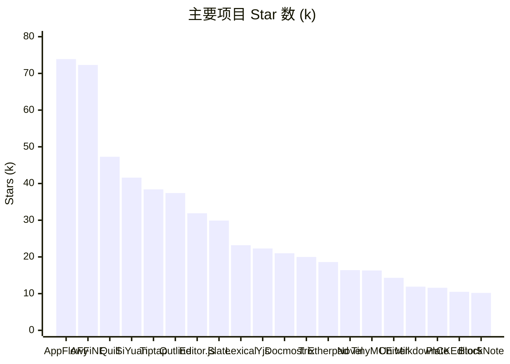
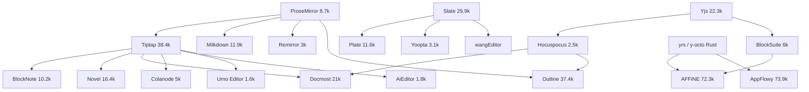

# 类飞书文档 / 富文本编辑器 开源项目调研

> 调研日期：2026-09-19
> 数据来源：GitHub 仓库页与 GitHub Topics 页（部分页面为数周内缓存快照，Star 数为约数，误差在 ±3% 以内）、各项目 README 与官方文档。
> 依赖信息说明：沙箱环境无法直接拉取各仓库的 `package.json` / `Cargo.toml`，依赖清单基于 README「Upstreams / Tech stack」章节、官方文档及对各仓库结构的了解整理，具体版本号建议在选型前以仓库 lockfile 为准复核。

---

## 一、总览统计

按「离类飞书文档产品的距离」分为四层：**完整产品 → 块编辑器（Notion 风格）→ 编辑器框架 → 协同底层**。

### 1.1 完整产品（可直接对标飞书文档 / Notion / Confluence）

| 项目 | Stars | License | 主语言 | 编辑器内核 | 协同方案 | 后端 |
|---|---|---|---|---|---|---|
| [AppFlowy](https://github.com/AppFlowy-IO/AppFlowy) | 73.9k | AGPL-3.0 | Dart + Rust | 自研 appflowy_editor (Flutter) | yrs (Rust CRDT) | Rust (AppFlowy-Cloud) + PostgreSQL |
| [AFFiNE](https://github.com/toeverything/AFFiNE) | 72.3k | MIT (前端) + EE (后端) | TypeScript + Rust | BlockSuite (自研) | Yjs + y-octo (Rust) | NestJS + GraphQL + PostgreSQL |
| [SiYuan 思源笔记](https://github.com/siyuan-note/siyuan) | ~41.6k | AGPL-3.0 | Go + TypeScript | Protyle (自研) | 端到端加密同步（非实时多人） | Go kernel + SQLite |
| [Outline](https://github.com/outline/outline) | ~37.4k | BSL 1.1 | TypeScript | ProseMirror (自研封装) | Yjs + Hocuspocus | Node/Koa + PostgreSQL |
| [Docmost](https://github.com/docmost/docmost) | 21k | AGPL-3.0 | TypeScript | Tiptap | Yjs + Hocuspocus | NestJS + PostgreSQL |
| [Etherpad](https://github.com/ether/etherpad) | 18.6k | Apache-2.0 | TypeScript | 自研 ace2 | Easysync (OT) | Node + ueberDB |
| [Univer](https://github.com/dream-num/univer) | 14.3k | Apache-2.0 | TypeScript | 自研 (Canvas 渲染) | Pro 版 OT (商业) | 可 headless 运行于 Node |
| [CryptPad](https://github.com/cryptpad/cryptpad) | 7.8k | AGPL-3.0 | JavaScript | CKEditor / 自研 | ChainPad (E2EE) | Node |
| [Colanode](https://github.com/colanode/colanode) | 5k | Apache-2.0 | TypeScript | Tiptap | Yjs | Node + PostgreSQL |
| [think 云策文档](https://github.com/fantasticit/think) | 2.1k | MIT | TypeScript | Tiptap | Yjs + Hocuspocus | NestJS + Next.js + MySQL |

### 1.2 块编辑器（Notion 风格，开箱即用）

| 项目 | Stars | License | 基座 | UI 框架 | 特点 |
|---|---|---|---|---|---|
| [Editor.js](https://github.com/codex-team/editor.js) | 31.9k | Apache-2.0 | 自研 | 框架无关 | 每个 block 独立 contenteditable，输出干净 JSON |
| [Novel](https://github.com/steven-tey/novel) | 16.4k | Apache-2.0 | Tiptap | React/Next.js | Notion 风格 + AI 自动补全 |
| [Plate](https://github.com/udecode/plate) | 11.6k | MIT | Slate | React + shadcn/ui | 插件体系最完整的 Slate 生态 |
| [BlockNote](https://github.com/TypeCellOS/BlockNote) | 10.2k | MPL-2.0 | Tiptap/ProseMirror | React (Mantine/shadcn/Ariakit) | 原生 Yjs 协同、块级 schema |
| [BlockSuite](https://github.com/toeverything/blocksuite) | 6k | MIT | 自研 + Yjs | Lit (Web Components) | AFFiNE 编辑器内核，CRDT 即文档模型 |
| [Yoopta](https://github.com/yoopta-editor/Yoopta-Editor) | 3.1k | MIT | Slate | React | 多编辑器风格（Notion/Craft/Medium） |
| [AiEditor](https://github.com/aieditor-team/AiEditor) | 1.8k | LGPL | Tiptap | 框架无关 | 国产，AI 优先 |
| [Umo Editor](https://github.com/umodoc/editor) | 1.6k | MIT | Tiptap 3 | Vue 3 | 国产，类 Word 分页排版 |
| [Textbus](https://github.com/textbus/textbus) | 1.4k | MIT | 自研 | Viewfly/Vue/React | 国产，组件化 + 协同 |

### 1.3 编辑器框架（底层内核）

| 项目 | Stars | License | 数据模型 | 框架绑定 | 协同支持 |
|---|---|---|---|---|---|
| [Quill](https://github.com/slab/quill) | 47.3k | BSD-3 | Delta (线性 op) + Parchment | 框架无关 | y-quill / 自带 OT 友好 |
| [Tiptap](https://github.com/ueberdosis/tiptap) | 38.4k | MIT | ProseMirror 文档树 | React / Vue / Svelte / 原生 | @tiptap/extension-collaboration (Yjs) |
| [Slate](https://github.com/ianstormtaylor/slate) | 29.9k | MIT | JSON 树 (自定义) | React only | slate-yjs (社区) |
| [Lexical](https://github.com/facebook/lexical) | 23.2k | MIT | 不可变 EditorState 节点树 | React (官方) / 其他社区 | @lexical/yjs (官方) |
| [Trix](https://github.com/basecamp/trix) | 20k | MIT | 自研 | 框架无关 (Custom Elements) | 无 |
| [TinyMCE](https://github.com/tinymce/tinymce) | 16.3k | GPL-2.0+ / 商业 | HTML DOM | 各框架 wrapper | 商业 |
| [Milkdown](https://github.com/Milkdown/milkdown) | 11.9k | MIT | ProseMirror + remark AST | 框架无关 | y-prosemirror |
| [CKEditor 5](https://github.com/ckeditor/ckeditor5) | 10.5k | GPL-2.0+ / 商业 | 自研 model-view 引擎 | 各框架 wrapper | 内置 OT (商业) |
| [ProseMirror](https://github.com/ProseMirror/prosemirror) | 8.7k* | MIT | Schema 约束的文档树 + Transaction | 框架无关 | y-prosemirror (官方维护) |
| [Remirror](https://github.com/remirror/remirror) | 3k | MIT | ProseMirror | React | y-prosemirror |

\* ProseMirror 拆分为多个包（prosemirror-model/state/view/transform 等），主仓库 star 数低估了实际影响力——Tiptap、BlockNote、Milkdown、Remirror、Outline、Novel 均基于它。

### 1.4 协同底层（CRDT / OT / 同步服务）

| 项目 | Stars | License | 语言 | 说明 |
|---|---|---|---|---|
| [Yjs](https://github.com/yjs/yjs) | 22.3k | MIT | JavaScript | 事实标准 CRDT，绑定 ProseMirror/Quill/Slate/Lexical/CodeMirror/Monaco |
| [Loro](https://github.com/loro-dev/loro) | 6k | MIT | Rust (WASM) | 新一代 CRDT，支持富文本、版本控制式历史 |
| [Hocuspocus](https://github.com/ueberdosis/hocuspocus) | 2.5k | MIT | TypeScript | Tiptap 团队维护的 Yjs WebSocket 服务端（鉴权、持久化、Redis 扩展） |
| [y-octo](https://github.com/y-crdt/y-octo) / [yrs](https://github.com/y-crdt/y-crdt) | — | MIT | Rust | Yjs 的 Rust 实现，AFFiNE / AppFlowy 服务端使用 |
| [Automerge](https://github.com/automerge/automerge) | — | MIT | Rust (WASM) | 另一主流 CRDT，JSON 导向 |

---

## 二、完整产品详细分析

### 2.1 AFFiNE — 72.3k ⭐

**定位**：Notion + Miro 的开源替代，"Write, Draw and Plan All at Once"，文档与无限画布（Edgeless）深度融合。新加坡公司 TOEVERYTHING 运营。

**架构**

```
┌────────────────────────────────────────────────────────────┐
│  客户端 (Web / Electron / iOS / Android)                     │
│  React + Jotai (状态) + vanilla-extract (CSS-in-TS)         │
│  ┌──────────────────────────────────────────────────────┐  │
│  │ BlockSuite 编辑器内核 (Lit Web Components)             │  │
│  │  - @blocksuite/store   → 文档模型 = Y.Doc (CRDT 即状态) │  │
│  │  - @blocksuite/block-std → 块规范 / 选区 / 命令 / 事件   │  │
│  │  - @blocksuite/blocks  → 内置块(Paragraph/List/Database…)│  │
│  │  - @blocksuite/inline  → 行内富文本 (基于 Y.Text)        │  │
│  │  - Edgeless 画布 (Canvas 渲染 + DOM 混合)               │  │
│  └──────────────────────────────────────────────────────┘  │
│  本地存储: IndexedDB / SQLite (Electron, 经 napi-rs 调用 Rust) │
└─────────────────────┬──────────────────────────────────────┘
                      │ WebSocket (Yjs update 二进制) + GraphQL
┌─────────────────────▼──────────────────────────────────────┐
│  服务端 (packages/backend, EE License)                       │
│  NestJS + GraphQL (Apollo) + Prisma + PostgreSQL + Redis    │
│  y-octo (Rust) 做服务端 CRDT 合并 / 快照                      │
│  对象存储 (S3/R2) 存 blob                                    │
└────────────────────────────────────────────────────────────┘
```

**核心依赖（README Upstreams + 仓库结构）**

| 类别 | 依赖 |
|---|---|
| 编辑器 | BlockSuite（同仓 `blocksuite/` 目录）、Lit |
| CRDT / 同步 | yjs、y-protocols、y-octo (Rust, napi-rs 绑定) |
| 前端 | React 19、Jotai、vanilla-extract、react-router、Vite |
| 桌面 / 移动 | Electron、Capacitor (iOS/Android)、napi-rs |
| 服务端 | NestJS、GraphQL、Prisma、PostgreSQL、Redis、socket.io |
| Rust 生态 | Cargo workspace（`.cargo/`、`Cargo.toml`）、OctoBase 数据引擎 |
| 工程 | Yarn 4 workspaces、oxlint / oxfmt、Vitest、Playwright、TypeDoc |

**产品设计要点**
- **Everything is a block**：段落、数据库视图、嵌入页、形状、幻灯片都是 block，可放在文档流也可放在画布上。
- **Local-first**：Y.Doc 是唯一真相源，离线可编辑，上线后 CRDT 自动合并；云端只是另一个 peer。
- **协同即数据模型**：BlockSuite 不是"编辑器 + 协同插件"，而是把 CRDT 直接当成文档 store，避免了 ProseMirror ↔ Yjs 双向绑定的一致性问题。
- **许可**：前端 MIT，后端 EE（可看不可改），商业化路径清晰。

**对类飞书文档的参考价值**：★★★★★ —— 数据模型设计（Block + CRDT）最值得研究；但 BlockSuite 学习曲线陡、Lit 生态小，直接复用成本高。

---

### 2.2 AppFlowy — 73.9k ⭐

**定位**：AI 协作工作空间，开源 Notion 替代；主打数据自主（本地 + 自托管云）。

**架构**

```
Flutter UI (Dart)  ──FFI (protobuf 消息)──▶  flowy-core (Rust)
  └ appflowy_editor (Dart 富文本)              ├ collab (基于 yrs CRDT)
  └ 数据库视图 (Grid/Board/Calendar)           ├ 本地 SQLite (diesel)
                                               └ 与 AppFlowy-Cloud 同步
AppFlowy-Cloud (Rust: actix-web + PostgreSQL + Redis + S3 + gotrue 鉴权)
```

**核心依赖**

| 类别 | 依赖 |
|---|---|
| 前端 | Flutter、appflowy_editor（自研 Dart 包，独立仓库）、flutter_bloc、GoRouter |
| 核心 | Rust workspace：collab / collab-document / collab-database、yrs、diesel + SQLite、protobuf、tokio |
| 云端 | actix-web、sqlx + PostgreSQL、Redis、gotrue (Supabase 鉴权分支)、S3 兼容存储 |
| AI | 集成 OpenAI / 本地 Ollama |

**产品设计要点**
- 编辑器 **不基于 Web contenteditable**，是 Flutter 原生渲染，跨端一致性极好，但 Web 体验（IME、可访问性）历史上弱于 DOM 方案。
- 文档模型 `Document` 由 `Node` 树 + `Delta`（行内属性）组成，与 Quill Delta 思路接近。
- Rust 核心复用到桌面、移动、服务端三端，业务逻辑只写一份。

**对类飞书文档的参考价值**：★★★☆☆ —— 如果你做 Web 产品，Flutter 路线不适合；但 "Rust 核心 + yrs" 的服务端协同架构值得借鉴。

---

### 2.3 Outline — ~37.4k ⭐

**定位**：面向团队的知识库 / Wiki，Markdown 兼容，实时协同，界面极简。

**架构**
- 单体 Node 应用：Koa 服务端 + React (MobX) 前端，同仓部署。
- 编辑器：**自研 ProseMirror 封装**（`shared/editor`），前身是 `rich-markdown-editor`；Markdown 序列化 / 反序列化用 prosemirror-markdown。
- 协同：`@hocuspocus/server` + `y-prosemirror`，文档以 Yjs 二进制 state 存 PostgreSQL；同时保留 Markdown 文本用于搜索与导出。

**核心依赖**

| 类别 | 依赖 |
|---|---|
| 编辑器 | prosemirror-model/state/view/transform/commands/inputrules/markdown、prosemirror-tables |
| 协同 | yjs、y-prosemirror、@hocuspocus/server、@hocuspocus/provider |
| 服务端 | Koa、Sequelize + PostgreSQL、Redis、Bull (队列)、Passport (SSO: Google/Slack/OIDC/SAML) |
| 前端 | React、MobX、styled-components、react-router |
| 存储 | S3 兼容 / 本地文件 |

**产品设计要点**
- "文档 = Markdown 超集"：所有块都能无损导出 Markdown，对迁移友好。
- 权限模型：Team → Collection → Document 三级，Collection 级别 ACL。
- 全文搜索用 PostgreSQL `tsvector`，无外部搜索引擎。

**对类飞书文档的参考价值**：★★★★☆ —— 最接近"一个团队可以自己维护"的完整实现；ProseMirror + Hocuspocus 这套栈成熟、可控。License 为 BSL 1.1（4 年后转 Apache），商用需注意。

---

### 2.4 Docmost — 21k ⭐

**定位**：Confluence / Notion 的开源替代，增长最快的新项目（2023 起）。

**架构**
- Monorepo (pnpm)：`apps/server` (NestJS) + `apps/client` (React + Vite) + `packages/editor-ext` (Tiptap 扩展)。
- 编辑器：**Tiptap**，自定义扩展实现 callout、mention、mathematics、draw.io / Excalidraw / Mermaid 嵌入。
- 协同：内嵌 Hocuspocus 服务（作为 NestJS 模块），Yjs 二进制存 PostgreSQL `pages.ydoc` 列，同时冗余存 JSON / 纯文本用于搜索。

**核心依赖**

| 类别 | 依赖 |
|---|---|
| 编辑器 | @tiptap/core / react / pm、@tiptap/extension-*、tiptap-pro (部分)、lowlight (代码高亮) |
| 协同 | yjs、@hocuspocus/server、@hocuspocus/provider、y-prosemirror |
| 服务端 | NestJS、Kysely (类型安全 SQL) + PostgreSQL、Redis、BullMQ、Passport |
| 前端 | React、Mantine UI、Jotai、TanStack Query、react-router |
| 存储 | S3 / 本地；导入导出 Markdown / HTML / Confluence |

**产品设计要点**
- Space → Page（树形）结构，页面支持无限层级，侧栏树可拖拽。
- 评论、@提及、页面历史版本、Group 权限。
- 图表类块全部走「第三方 iframe/组件 + 存序列化数据」路线，快速堆功能。

**对类飞书文档的参考价值**：★★★★★ —— 如果目标是「6 个月内做出可用的类飞书文档」，Docmost 是最贴近的参考实现，技术栈全部是主流、文档齐全的库。

---

### 2.5 SiYuan 思源笔记 — ~41.6k ⭐

**定位**：国产、隐私优先的个人知识管理，块级引用 + Markdown WYSIWYG。

**架构**
- Go 内核（`kernel/`）负责文件系统、SQLite 索引、Lute (Go 写的 Markdown 引擎)、同步加密。
- 前端 TypeScript，编辑器 **Protyle** 自研（前身 Vditor），DOM 直接操作，`.sy` JSON 文件持久化。
- 同步：S3 / WebDAV / 官方云，端到端加密，**不是实时多人协同**（单用户多设备）。

**核心依赖**：Go (gin、sqlite3、lute)、Electron、TypeScript、Protyle、PDF.js、KaTeX、Mermaid、ECharts。

**参考价值**：★★☆☆☆ —— 块引用、SQL 查询嵌入、数据库属性视图的设计值得看；但协同模型不同，不适合作为团队文档参考。

---

### 2.6 Univer — 14.3k ⭐

**定位**：国产（Luckysheet 团队），"全栈办公框架"：Sheets / Docs / Slides 一套架构，Canvas 渲染，可 headless 运行在 Node。

**架构**
- 依赖注入容器 `redi` + 插件系统：每个能力（渲染、公式、UI、协同）都是 plugin。
- 自研文档模型 `DocumentDataModel`（段落 / 文本 run / 表格），Canvas 自绘排版（非 contenteditable）。
- 命令模式（Command / Mutation / Operation）天然适配 OT 协同，协同在 Univer Pro（商业）。

**核心依赖**：@univerjs/core / engine-render / engine-formula / docs / docs-ui / ui、redi、rxjs、React (UI 层)、Intl.Segmenter。

**参考价值**：★★★☆☆ —— 若产品需要「文档 + 表格 + 幻灯片」统一底座，或需要精确分页排版（类 Word），Univer 是唯一开源选项；纯文档场景过重。

---

### 2.7 Etherpad — 18.6k ⭐

老牌实时协同编辑器（2008），Easysync OT 算法，插件生态 300+，但富文本能力偏弱（行级属性），更适合作为 OT 算法的学习样本，而非产品基座。

---

## 三、编辑器框架深度对比

### 3.1 ProseMirror 系（Tiptap / BlockNote / Milkdown / Remirror / Outline）

**ProseMirror 核心概念**
- **Schema**：严格定义节点类型、内容表达式（`block+`、`inline*`）、marks，非法结构无法产生。
- **不可变 Document + Transaction**：所有修改是 `Step` 序列，天然可撤销、可映射位置、可协同。
- **Plugin**：state 字段 + view props + `appendTransaction`，扩展点极多。
- **MutationObserver + contenteditable**：DOM 变更反推文档变更，Android / CJK 输入法兼容最成熟（Notion 工程师公开评价：ProseMirror 是目前最稳的选择）。

**Tiptap 在此之上做了什么**
- `@tiptap/core`：Extension / Node / Mark 三种扩展抽象，链式命令 API `editor.chain().focus().toggleBold().run()`。
- `@tiptap/pm`：重新导出所有 prosemirror-* 包，统一版本。
- `@tiptap/react` / `vue-3` / `svelte`：`NodeViewWrapper` 让你用框架组件渲染节点。
- 100+ 官方扩展；**Pro 扩展收费**（Comments、AI、Version history、Import/Export docx、Drag handle 部分）。
- Tiptap 3 (2025)：静态渲染、Markdown 支持、更好的 SSR。

**BlockNote 在 Tiptap 之上做了什么**
- 把 ProseMirror 的「段落流」强制为「Block 容器 → 内容」的两级结构（`blockContainer` / `blockGroup`），实现 Notion 式拖拽、嵌套、`/` 菜单、侧边手柄。
- 用 zod-like schema 声明自定义 block，自动生成 TS 类型。
- UI 层可换：Mantine / shadcn / Ariakit。
- 协同直接暴露 `collaboration: { provider, fragment }`，接 Yjs 即可。

### 3.2 Slate 系（Slate / Plate / Yoopta / wangEditor）

- 数据模型是普通 JSON 树 `[{ type, children: [{ text, bold }] }]`，无 schema 强约束，靠 `normalizeNode` 修正。
- **React only**（slate-react），渲染完全交给 React，自定义元素最自然。
- 历史弱点：Android 输入法、CJK 组合输入、大文档性能；0.100+ 版本引入 `slate-dom` 有改善。
- Plate 是 Slate 生态事实上的「Tiptap」：60+ 插件、shadcn/ui 组件、AI 扩展、docx 导入导出；但仍继承 Slate 的底层风险。
- wangEditor v5 基于 Slate，国内使用广，目前已进入维护模式。

### 3.3 Lexical（Meta）

- 编辑器状态是**不可变 EditorState**，节点是 class（`ParagraphNode`、`TextNode`），通过 `editor.update()` 内的双缓冲修改。
- 用 `$` 前缀函数（`$getRoot()`）标记只能在 update 闭包内调用的 API。
- 官方 `@lexical/yjs` 协同、`@lexical/react` 插件集（RichTextPlugin、HistoryPlugin、ListPlugin…）。
- Facebook / Instagram / WhatsApp Web 生产使用，可访问性好；社区插件少于 Tiptap，中文资料少。

### 3.4 Quill

- **Delta** 数据模型：`{ ops: [{ insert: 'Hello', attributes: { bold: true } }] }`，线性、OT 友好、极易 diff。
- Parchment 将 Delta 映射为 Blot 树，自定义格式要写 Blot。
- 2024 发布 v2（TypeScript 重写），但**块级嵌套能力弱**（列表/表格是历史痛点，`quill-better-table` 等第三方补丁），做 Notion 风格块编辑器不合适；做评论框、聊天输入框、简单文章编辑器很好。

### 3.5 Editor.js

- 每个 block 是独立 contenteditable，block 间没有统一选区 —— 跨块选择、拖拽、协同都困难。
- 输出 JSON 干净，适合 CMS 内容录入，不适合协同文档。

### 3.6 CKEditor 5 / TinyMCE

- 完整的商业级产品，开箱即用，功能最全（表格合并、修订、评论、docx 粘贴保真）。
- 协同（CKEditor 的 OT 实时协作）与高级功能收费；GPL 许可对 SaaS 闭源产品不友好。

### 3.7 框架选型速查

| 需求 | 推荐 |
|---|---|
| Notion / 飞书风格块编辑器，React，要快 | **BlockNote** 或 Novel |
| 完全自定义 UI，需要 Vue 或多框架 | **Tiptap** |
| 想掌控每一层、长期演进、团队有编辑器经验 | **ProseMirror 直接用** (Outline 路线) |
| 已深度绑定 React、需要 shadcn 风格全套 UI | **Plate** |
| Meta 生态 / 可访问性优先 | **Lexical** |
| 文档 + 表格 + 幻灯片统一底座、分页排版 | **Univer** |
| 简单富文本输入框 | **Quill** |

---

## 四、协同架构对比

| 方案 | 代表 | 原理 | 服务端角色 | 离线 | 适用 |
|---|---|---|---|---|---|
| **CRDT (Yjs)** | AFFiNE、Docmost、Outline、BlockNote、Colanode | 每个客户端持有完整 Y.Doc，update 二进制广播，任意顺序合并收敛 | 中继 + 持久化（Hocuspocus / y-websocket / y-redis），无需理解文档语义 | 天然支持 | 绝大多数新项目 |
| **CRDT (Rust)** | AppFlowy (yrs)、AFFiNE 服务端 (y-octo)、Loro | 同上，Rust 实现，服务端可高效合并 / 快照 / 做权限过滤 | 可做服务端计算 | 天然支持 | 需要服务端处理文档内容 |
| **OT** | Etherpad (Easysync)、CKEditor 5、Univer Pro、Google Docs / 飞书 | 中心服务器给操作定序并 transform | 必须有中心权威，理解操作语义 | 需额外设计 | 需要严格服务端权限 / 审计 |

**Yjs 栈的典型服务端组件（Hocuspocus）**
- `onAuthenticate`：校验 token，决定 read-only / read-write。
- `onLoadDocument` / `onStoreDocument`：从 DB 读写 `Y.encodeStateAsUpdate()` 二进制，debounce 落库。
- `@hocuspocus/extension-redis`：多实例水平扩展。
- `@hocuspocus/extension-database`：自定义存储。
- Awareness：光标、在线用户列表。

**存储策略共识**（Docmost / Outline / AFFiNE 均如此）
1. 主存 Yjs 二进制 state（唯一真相源）。
2. 冗余存 ProseMirror JSON 或 HTML（用于 API 输出、渲染只读页）。
3. 冗余存纯文本 / Markdown（用于全文搜索、AI embedding）。
4. 定期快照 + update 日志（用于版本历史）。

---

## 五、面向「类飞书文档」的选型建议

飞书文档的关键特征：块编辑 + 实时多人协同 + 评论/@ + 权限体系 + 多维表格/画板嵌入 + 移动端 + 中文 IME 体验。

### 推荐方案 A：快速验证（3–6 个月出 MVP）

```
前端  React + Vite + BlockNote (或 Tiptap + 自建 UI)
协同  Yjs + Hocuspocus (内嵌到后端进程)
后端  NestJS 或 Fastify + PostgreSQL (Kysely / Prisma) + Redis + S3
参考  直接读 Docmost 源码，它就是这套组合的完整实现
```

优点：全部是 MIT/Apache 依赖，无授权风险；社区资料最多；Docmost 已验证可行。
风险：BlockNote MPL-2.0 需注意（修改其源码需开源该部分）；Tiptap Pro 扩展（评论、版本历史）收费，需自研或用 BlockNote 内置。

### 推荐方案 B：长期自主可控

```
编辑器  ProseMirror 直接使用，参考 Outline 的 shared/editor 封装
        自定义 Block 容器结构（参考 BlockNote 的 blockContainer/blockGroup 设计）
协同    Yjs 前端 + yrs/y-octo (Rust) 服务端做合并、快照、权限过滤
后端    Rust (axum) 或 Go；PostgreSQL；对象存储
```

优点：无中间层依赖升级风险；服务端可读懂文档做权限 / 审计 / AI；性能上限高。
风险：投入至少 2–3 名有编辑器经验的工程师，前 6 个月无产出。

### 不建议
- **Slate 系**做主编辑器：中文 IME 与 Android 问题会持续消耗团队。
- **Quill / Editor.js**：块级嵌套与协同能力不足。
- **Flutter (AppFlowy 路线)**：Web 端体验与 SEO / 嵌入能力受限，除非移动端优先。

### 值得单独借鉴的设计
| 设计点 | 参考项目 |
|---|---|
| Block + CRDT 一体化数据模型 | AFFiNE / BlockSuite |
| Space → Page 树 + 权限 + 评论 + 版本 | Docmost、Outline |
| Markdown 无损互转 | Outline、Milkdown |
| 多维表格 / 数据库块 | AFFiNE、AppFlowy、SiYuan 属性视图 |
| 文档 + 画布融合 | AFFiNE Edgeless |
| 类 Word 分页排版 | Univer Docs、Umo Editor |
| 块引用 / 双链 | SiYuan、Outline backlinks |

---

## 六、自研类飞书文档：产品设计框架

在决定技术栈之前，先用下面的框架把「产品要做成什么」定下来；第七节的架构设计是这一节的实现。

### 6.1 定位与目标用户

| 维度 | 需要回答的问题 | 示例答案（团队知识库方向） |
|---|---|---|
| 核心场景 | 用户打开产品的第一件事是什么 | 写会议纪要 / 需求文档 / 团队 Wiki 并与同事实时协作 |
| 目标用户 | 谁付费、谁使用、谁管理 | 付费：团队管理者；使用：全员；管理：IT/知识管理员 |
| 替代对象 | 用户现在用什么 | 飞书文档、Notion、Confluence、Word + 网盘 |
| 差异化 | 凭什么迁移过来 | 私有化部署 / 数据自主 / AI 深度集成 / 与自家业务系统打通 |
| 不做什么 | 明确边界 | 不做 IM、不做项目管理、不做表格公式引擎（P0–P2 阶段） |

### 6.2 信息架构（IA）

```
组织 Workspace
 └ 知识库 Space（团队 / 项目 / 个人）
    └ 页面 Page（无限层级树，可拖拽）
       └ 块 Block（文档的最小单位）
          └ 行内内容 Inline（文字 + 样式 + @提及 + 链接）

横切概念：
 · 收藏 / 最近访问 / 我的草稿      → 个人入口
 · 评论 / 通知 / 版本历史          → 围绕 Page 的协作对象
 · 权限 / 分享链接 / 群组          → 围绕 Space 与 Page 的访问控制
 · 搜索 / 标签 / 双向链接          → 跨页面的发现机制
```

### 6.3 功能地图（按优先级）

| 层级 | 模块 | P0 必须 | P1 团队可用 | P2 差异化 |
|---|---|---|---|---|
| 编辑 | 基础块 | 段落、标题、有序/无序/任务列表、引用、分割线、代码块、图片、表格 | 折叠块、标注 Callout、公式、附件 | 多维表格、画板、幻灯片模式 |
| 编辑 | 交互 | `/` 菜单、Markdown 快捷输入、浮动工具栏、拖拽排序 | 块引用、双链、大纲导航 | AI 续写/总结/改写、模板中心 |
| 协同 | 实时 | 多人光标、在线头像、冲突自动合并 | 评论 + @提及、划词评论、已读 | 建议模式（修订）、块级锁 |
| 组织 | 页面树 | 创建/移动/删除/恢复、面包屑 | 收藏、最近访问、回收站 | 空间模板、跨空间移动 |
| 访问 | 权限 | 空间级：管理者/成员/访客 | 页面级覆盖、群组、公开分享链接（只读/可评论） | 密码分享、到期链接、水印 |
| 发现 | 搜索 | 标题 + 全文 | 高亮片段、筛选（空间/作者/时间） | 语义搜索、AI 问答 |
| 数据 | 导入导出 | Markdown 导入导出 | HTML、Word 导入、PDF 导出 | Notion / Confluence / 飞书 迁移工具 |
| 平台 | 端 | Web | 桌面端（Electron/Tauri） | 移动端、浏览器剪藏插件 |
| 管理 | 后台 | 成员管理、基础审计 | SSO（OIDC/SAML）、用量统计 | 合规导出、数据留存策略、开放 API |

### 6.4 核心用户流程

1. **新建并写作**：侧栏「+」→ 空白页 → 输入 `/` 选块或直接 Markdown → 自动保存（无保存按钮）。
2. **邀请协作**：右上「分享」→ 选人/群组/生成链接 → 对方打开即见光标 → 划词评论 → 被 @ 者收到通知。
3. **组织与查找**：页面拖入知识库树 → 收藏 → `Ctrl/⌘ K` 全局搜索 → 大纲跳转。
4. **回溯**：页面菜单 → 历史版本 → 对比 → 恢复。
5. **迁移进入**：导入 Markdown/Notion 导出包 → 自动建树 → 修正后发布。

每条流程都应有可量化的体验指标（见 6.6）。

### 6.5 块系统设计原则（产品层面）

- **一切皆块**：段落也是块，块有稳定 ID，可被评论、引用、拖拽、单独分享。
- **块是内容，样式是属性**：颜色、对齐、宽度存在 `props`，不改变块类型。
- **复杂块自成一体**：多维表格、画板内部状态独立，主文档只保留占位与引用，避免拖慢主文档。
- **渐进披露**：默认界面只有输入框，工具栏、手柄、菜单在 hover / 选中时才出现。
- **Markdown 是快捷键不是格式**：输入 `## ` 立即转为标题，但底层存结构化数据，不依赖 Markdown 文本。

### 6.6 非功能需求与指标

| 类别 | 指标 | 目标值 |
|---|---|---|
| 性能 | 首屏可编辑时间 | < 1.5s（万字文档） |
| 性能 | 单文档块数上限 | 5,000 块流畅（虚拟滚动可选） |
| 协同 | 编辑同步延迟 (P95) | < 200ms 同区域 |
| 协同 | 同一文档并发人数 | ≥ 50 |
| 可靠 | 数据丢失 | 0；断网编辑不丢，重连自动合并 |
| 兼容 | 中文 IME | Windows 微软拼音 / macOS 拼音 / 搜狗 全部无丢字、无重复 |
| 兼容 | 浏览器 | Chrome/Edge 最近 2 版、Safari 16+、Firefox 最近 2 版 |
| 安全 | 传输/存储 | TLS、附件签名 URL、可选静态加密 |

### 6.7 产品 → 架构 映射

| 产品决策 | 架构含义（见第七节） |
|---|---|
| 一切皆块 + 块 ID | Schema 采用 blockContainer/blockGroup 两级结构，ID 存节点 attrs |
| 实时协同、无保存按钮 | Yjs CRDT + Hocuspocus，前端不做「保存」概念 |
| 划词评论、@提及 | 评论锚点 = 块 ID + Yjs RelativePosition，需在 Y.Doc 内维护 |
| 全文搜索 / AI | 服务端冗余投影纯文本 + JSON，不直接查 Yjs 二进制 |
| 版本历史 | Worker 定期快照 + update 日志 |
| 私有化部署 | 单 docker-compose 可拉起：API + 协同 + PG + Redis + MinIO |
| 多维表格 / 画板 | 原子节点 + 独立 Y.Map，可独立扩展渲染引擎 |

---

## 七、自研类飞书文档：架构设计框架（基于以上对比）

综合上面的调研，下面给出一份面向「类飞书文档」的参考架构。原则：**内核用 ProseMirror 系（可控）、协同用 Yjs（事实标准）、块模型借鉴 BlockNote/AFFiNE、服务端分层借鉴 Docmost/Outline**，所有核心依赖均为 MIT/Apache 许可。

### 7.1 总体分层

```
┌─────────────────────────────────────────────────────────────────────┐
│ 接入层  Web (React) │ Desktop (Electron/Tauri) │ Mobile (WebView 壳)  │
├─────────────────────────────────────────────────────────────────────┤
│ 应用层  工作台 / 知识库树 / 文档页 / 评论侧栏 / 搜索 / 通知 / 设置        │
├─────────────────────────────────────────────────────────────────────┤
│ 编辑器层 (@doc/editor)                                               │
│   ├ Block 模型层    blockContainer / blockGroup（参考 BlockNote）      │
│   ├ 扩展层          文本 / 列表 / 表格 / 代码 / 图片 / 多维表格 / 画板 …  │
│   ├ UI 层           / 菜单、拖拽手柄、浮动工具栏、@ 提及（自有组件库）    │
│   └ 内核            ProseMirror（经 Tiptap 或直接封装）                 │
├─────────────────────────────────────────────────────────────────────┤
│ 协同层 (@doc/collab)                                                 │
│   Yjs Y.Doc  ←→ y-prosemirror 绑定  ←→ Provider (WebSocket)          │
│   Awareness（光标/在线）· UndoManager · 离线队列 (IndexedDB y-indexeddb)│
├─────────────────────────────────────────────────────────────────────┤
│ 数据访问层  REST/GraphQL SDK · 文件上传 · 本地缓存                       │
└─────────────────────────────────────────────────────────────────────┘
                                   │ HTTPS / WSS
┌─────────────────────────────────────────────────────────────────────┐
│ 网关  Nginx / Traefik · 鉴权（JWT/Session）· 限流                       │
├────────────────────┬────────────────────┬───────────────────────────┤
│ API 服务 (NestJS)  │ 协同服务 (Hocuspocus) │ 异步 Worker (BullMQ)      │
│ 用户/空间/权限/评论  │ 房间管理·鉴权钩子     │ 快照·索引·导出·通知·AI     │
│ 页面树/版本/搜索    │ Redis 多实例扩展      │                           │
├────────────────────┴────────────────────┴───────────────────────────┤
│ 存储  PostgreSQL（元数据 + Yjs 二进制 + 冗余 JSON/文本）                  │
│      Redis（会话/缓存/PubSub）· S3 兼容对象存储（附件）                  │
│      Meilisearch / PG tsvector（全文检索）                              │
└─────────────────────────────────────────────────────────────────────┘
```

### 7.2 前端编辑器设计

| 模块 | 设计要点 | 借鉴来源 |
|---|---|---|
| 文档 Schema | 顶层 `doc > blockGroup > blockContainer+`，每个 container 含 `id` 与 `props`，内容节点独立定义；行内用 marks | BlockNote、AFFiNE |
| 块 ID | 每块生成稀疏有序 ID（如 nanoid），用于评论锚点、块引用、拖拽 | AFFiNE、SiYuan |
| 扩展机制 | 一个块 = Node + Command + Keymap + InputRule + NodeView（React 组件），按目录注册 | Tiptap Extension |
| 复杂块 | 多维表格、画板、代码块作为 **原子节点**，内部状态存独立 `Y.Map`，用 `NodeView` 渲染各自组件，避免污染主文档树 | AFFiNE Database、Docmost 嵌入 |
| 中文输入 | 依赖 ProseMirror 的 composition 处理；所有 InputRule 在 `compositionend` 后触发 | ProseMirror |
| 只读渲染 | 用 Tiptap 3 静态渲染 / 自写 JSON → HTML 渲染器，用于分享页与 SSR | Tiptap 3 |
| Markdown | 提供 `prosemirror-markdown` 序列化，保证导入导出无损 | Outline |

### 7.3 协同与数据一致性

1. **单一真相源**：`pages.ydoc BYTEA` 存 `Y.encodeStateAsUpdate()`。
2. **落库策略**：Hocuspocus `onStoreDocument` 防抖 2–5s 写入；Worker 每 N 分钟或每 M 次变更生成快照，写 `page_snapshots`，作为版本历史。
3. **冗余投影**：同一钩子内将 Y.Doc → ProseMirror JSON → 纯文本，写 `pages.content_json`、`pages.text`，供 API、搜索、AI 使用。
4. **权限**：`onAuthenticate` 校验 token 并返回 `readOnly`；块级权限不做（复杂度过高），走页面级 + 空间级 ACL。
5. **离线**：客户端 `y-indexeddb` 持久化，重连后自动合并。
6. **演进路径**：流量上来后可将协同服务换成 Rust（y-octo/yrs + axum），协议不变，前端零改动 —— 这是选 Yjs 而非 OT 的核心原因。

### 7.4 服务端领域模型

```
Workspace ─┬─ Member (role: owner/admin/member/guest)
           ├─ Space ─── Page (tree, parent_id, position)
           │              ├─ ydoc / content_json / text
           │              ├─ PageSnapshot (version history)
           │              ├─ Comment ─ CommentReply (anchor: block_id + range)
           │              └─ Attachment (S3 key)
           ├─ Group ─── GroupMember
           └─ Permission (subject: user|group, object: space|page, level)
```

### 7.5 依赖清单（推荐版本线）

| 层 | 依赖 | 许可 |
|---|---|---|
| 编辑器 | `@tiptap/core@3` `@tiptap/react` `@tiptap/pm`（或直接 `prosemirror-*`）、`prosemirror-tables`、`prosemirror-markdown`、`lowlight` | MIT |
| 协同 | `yjs` `y-prosemirror` `y-indexeddb` `@hocuspocus/provider` | MIT |
| 前端 | React 19、Vite、Zustand/Jotai、TanStack Query、react-router、自有组件库或 Radix + Tailwind | MIT |
| 服务端 | NestJS、Kysely 或 Prisma、`@hocuspocus/server` + `extension-redis`、BullMQ、Passport | MIT |
| 存储 | PostgreSQL 16、Redis 7、MinIO/S3、Meilisearch（可选） | 开源 |
| 桌面 | Electron 或 Tauri | MIT |

避免引入：Tiptap Pro 扩展（收费）、BlockNote 整体（MPL-2.0，改源码需开源）、CKEditor/TinyMCE（GPL）。

### 7.6 分阶段路线

| 阶段 | 目标 | 关键交付 |
|---|---|---|
| P0（0–2 月） | 能写、能协同 | 基础块（段落/标题/列表/引用/代码/图片/表格）、Yjs 协同、页面树、空间权限 |
| P1（3–4 月） | 团队可用 | 评论 + @ 提及、版本历史、全文搜索、Markdown 导入导出、分享链接 |
| P2（5–6 月） | 差异化 | 多维表格块、画板嵌入、模板、通知中心、移动端 WebView 壳 |
| P3（6 月+） | 规模化 | 协同服务 Rust 化、AI 写作/总结、审计日志、SSO |

---

## 八、Star 分布可视化（Mermaid）





---

## 九、参考链接

- GitHub Topics：[rich-text-editor](https://github.com/topics/rich-text-editor?o=desc&s=stars) · [notion-alternative](https://github.com/topics/notion-alternative?o=desc&s=stars) · [collaborative-editing](https://github.com/topics/collaborative-editing?o=desc&s=stars) · [tiptap](https://github.com/topics/tiptap)
- Yjs 编辑器绑定文档：https://docs.yjs.dev/ecosystem/editor-bindings
- Tiptap 官方：https://tiptap.dev · Hocuspocus：https://tiptap.dev/docs/hocuspocus
- Liveblocks《2025 年该选哪个富文本编辑器框架》：https://liveblocks.io/blog/which-rich-text-editor-framework-should-you-choose-in-2025
- Star 历史查询：https://star-history.com
